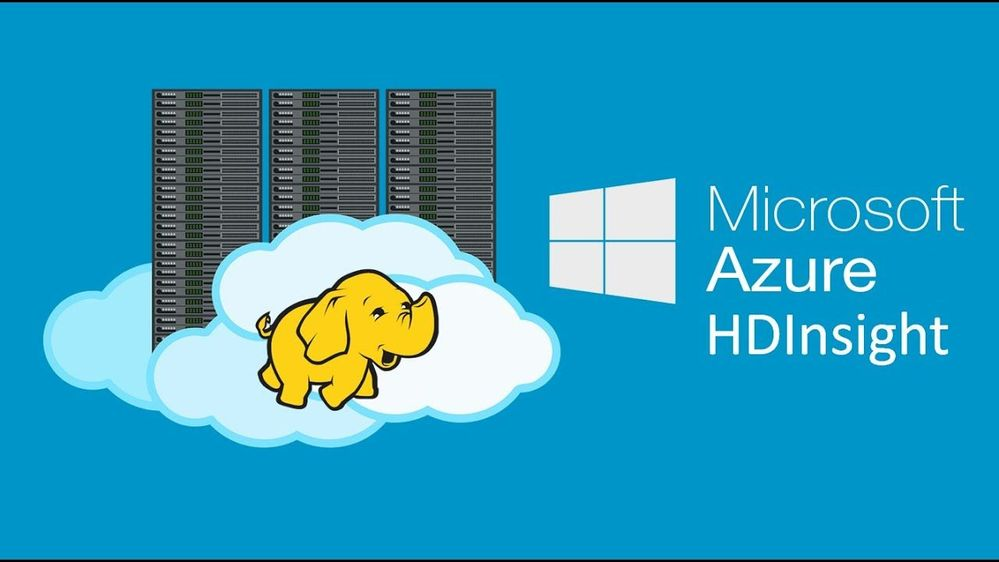

  
### About Me:    
I'm a passionate data scientist with a knack for predictive analytics, specializing in recurrent neural networks (RNN) and LSTM models. I thrive on tackling regression tasks and exploring the fascinating realm of reinforcement learning (RL). Additionally, I have a strong foundation in classical machine learning and possess the requisite mathematical prowess.

Currently, I'm delving into the realms of decentralized finance (DeFi) and web3, where I'm actively engaged in crafting and analyzing smart contracts. During my leisure time, you'll find me honing my problem-solving skills on LeetCode and participating in CTF challenges.
       
   
### Social media: 📡    
Join me on Telegram, where I share insights, victories, and even the occasional setback. Embrace the cyberpunk ethos with me. 

## Competitions: 🥇
 
### CTF's

| CTF | Result | Team | Date |
|-----|-----|-----|-----|
|CIT@CTF|top 6%| undermouses |04/2024|
|BSidesSF CTF|top 10%| movie43 |05/2024|
|swampCTF|top 17%|check_your_mouse |03/2024|
|vksCTF|top 18%| Solo played |09/2023|
|Space HeroesCTF| top 23% | undermouses |04/2024|
|AI CTF|top 23%|movie43|05/2024|
|BCACTF 5.0|top 25%|movie43|06/2024|
|vsCTF|top 26%| movie43 |06/2024|
|wolvCTF|top 31%| undermouses|03/2024|
|osuCTF|top 35%| undermouses |02/2024|
|ethernautCTF|out of competition|solo|03/2024|

### Algorithms [LeetCode](https://leetcode.com/sammorozov/)

### Working on: 🚀

- Learning [GO](https://github.com/sammorozov/go_basics_study)
- [fullstack web3 development course](https://github.com/sammorozov/full_course_crypto_32) 
- [ethernaut tasks](https://github.com/sammorozov/ethernaut_source_tasks)
- Various bots and scripts, with results showcased [here](https://t.me/from_the_teapot_to_the_investor)

## Languages and Tools 

### Languages:
| Python3 | SQL | R | SAS | Bash |
|----------|----------|----------|----------|----------|
|   |   |   |  |   |

### Python Libraries and Frameworks:
| PyTorch | TensorFlow | Selenium | NumPy | Pandas | scikit-learn | OpenCV | Matplotlib | Plotly |
|----------|----------|----------|----------|----------|----------|----------|----------|----------|
|  | |  |  |  |  | | | |

### Data Manipulation & Visualization Tools:
| Anaconda | Jupyter | MySQL | PostgreSQL | SQL Server | SQLite | Tableau | Power BI |
|----------|----------|----------|----------|----------|----------|----------|----------|
|||||||||

### Big Data Tools:
| Hadoop | Spark | Kafka | Airflow | Hive | Azure Synapse | Azure HDInsight |
|----------|----------|----------|----------|----------|----------|----------|
||||||||

### ETL Tools:
| Apache Nifi | Talend | Informatica | Alteryx | Azure Data Factory |
|----------|----------|----------|----------|----------|
||||||

### Cloud Computing:
| Azure |
|----------|
||

### Environments, Testing, and Other Tools:
| Node.js | Git | Docker | Pytest | VirtualBox |
|----------|----------|----------|----------|----------|
||||||

### Operating Systems:
| macOS | Windows | Linux | Ubuntu | Kali |
|----------|----------|----------|----------|----------|
|  |  |  |  |  |

### Tools for CTFs:
| Metasploit | Wireshark | Burp Suite | Netcat | Nmap |
|----------|----------|----------|----------|----------|
||||||

<!--

### It's not technology, but I use it. The section will be changed soon.:
  
  
  
  
  
  
  
  
    
  
  
  
--> 

---

  

  

---

  
  

 

  

 

