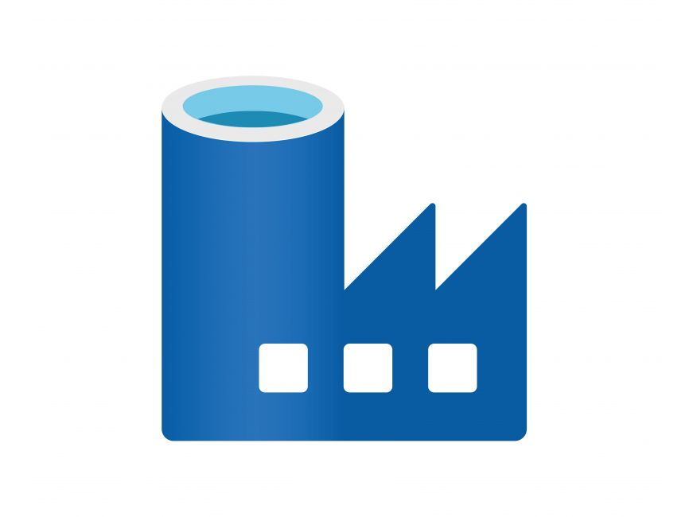

<!-- INTRO -->
<h1 align="center">👋 Hey, I'm Bassey Akom</h1>

  <strong>Data Scientist</strong> • <strong>Engineer</strong> • <strong>Analyst</strong> • <strong>Statistician</strong> 
  <em>I build intelligent systems that turn complex data into clear, actionable insight.</em>

  Passionate about math, code, and scalable analytics.  
  Currently exploring fractal derivatives, cloud ML, and real-time data engineering.

---

### 🔍 About Me

- 🎓 Mathematician turned data professional, grounded in statistical theory and real-world systems.
- 🛠️ Designing end-to-end data pipelines, ML workflows, and cloud-native solutions that scale.
- 🚀 Skilled in Python, SQL, R, SAS, PySpark, Azure, Power BI — building data platforms.
- 📊 Strong focus on **generative AI**, **real-time analytics**, **MLOps**, and **data reliability engineering**.
- 💬 I care about clarity, reproducibility, and automation.
- 🌍 Advocating for open-source collaboration and knowledge sharing in data science.

---

### Working on: 🚀

- Learning [GO](https://baci-ak.github.io/post.html)

---
### 📫 Connect With Me

  
  

---

## 🛠️ Tools & Technologies

 

### 🧑‍💻 Programming Languages
| Python | SQL | R | SAS | Bash |
|----------|----------|----------|----------|----------|
|   |  |  |  |  |

 

### 📦 Python Libraries & Frameworks
| PyTorch | TensorFlow | Selenium | NumPy | Pandas | scikit-learn | OpenCV | Matplotlib | Plotly |
|----------|----------|----------|----------|----------|----------|----------|----------|----------|
|  |  |  |  |  |  |  |  |  |

 

### 📊 Data Platforms & Visualization
| Anaconda | Jupyter | Power BI | Tableau |
|----------|----------|----------|----------|
|  |  |  |  |

 

### ⚙️ Big Data & Cloud Tools
| Hadoop | Spark | Kafka | Azure Synapse  | Airflow |
|--------|--------|--------|---------|----------------|
|  |  |  |  |

 

### 🧩 ETL & Data Engineering
| Apache NiFi | Talend | Azure Data Factory |
|-------------|--------|--------------------|
|  |  |  |

 

### ☁️ Cloud & DevOps
| Azure | Docker | Git |
|-------|--------|-----|
|  |  |  |

 

### 💻 Operating Systems
| macOS | Windows | Linux | Ubuntu |
|--------|---------|--------|--------|
|  |  |  |  |

 

---

### 📈 GitHub Stats & Activity

 

  
  

 

  

 

  

